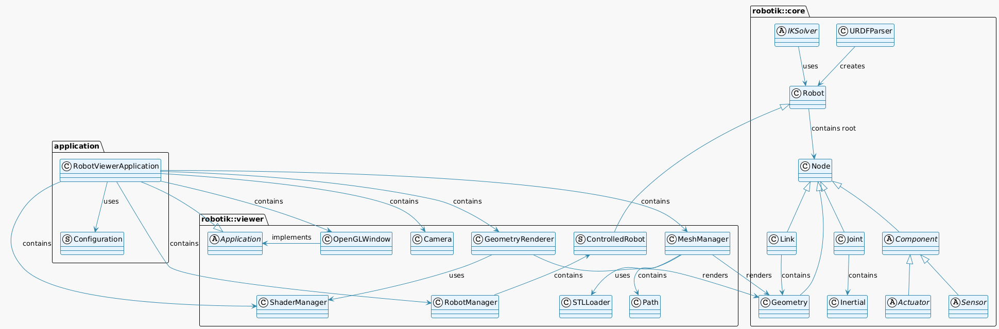

**WARNING: This project is currently in at its beginning age and is currently instable. Use it with care!**

See my [Youtube video](https://www.youtube.com/watch?v=BgFjewCz328)

# 🤖 RobotIK

C++ robotics library for simulation and visualization of robot (libraries and stand-alone applications).

- **Scene graph** : Hierarchical representation of robots (links, joints, geometries, collisions, actuators, sensors).
- **OpenGL visualization** : Real-time 3D rendering with interactive controls.
- **Forward and inverse kinematics** : Position and orientation calculations.

## ⚙️ Compilation

Prerequisites:

```bash
sudo apt-get install libeigen3-dev libgl1-mesa-dev libglew-dev libglfw3-dev swi-prolog-dev swi-prolog
```

Compilation:

```bash
git clone https://github.com/Lecrapouille/Robotik --recurse
cd Robotik
make -j8
make applications -j8
sudo make install

# Optional:
make tests -j8
```

A `build` folder should have been created, it contains the created shared and static libraries (librobotik-core.so, librobotik-viewer.so, ...) as well as the stand-alone applications (Robotik-Viewer, ...). In the following sections we will explain them in more details.

## 👁️ Robotik-Viewer

Is a stand-alone application loading a robot from a URDF file, visualizing it and controlling it.

```bash
./build/Robotik-Viewer <path/to/your/robot/file.urdf>
```

The application expected to have a URDF file to load. This project contains some files in the [data](data) folder. Type `-h` to display the help.

## 🏗️ Project Architecture

```bash
Robotik/
├── 📚 include/Robotik/
│   ├── Robotik.hpp                    # Main entry point for users
│   ├── Core/                          # Robotics core (lib)
│   │   └── ...
│   └── Viewer/                        # Robotics viewer (lib)
│   │   └── ...
├── 🔧 src/
│   ├── Robotik/                       # Robotics core implementation
│   │   └── ...
│   └── Viewer/                        # Robotics viewer implementation
│   │   └── ...
├── 🧪 tests/                          # Unit tests (core + viewer)
│   └── ...
├── 📖 docs/                           # Documentation and exemples
├── 📊 data/                           # Example URDF files
│   ├── cartesian_robot.urdf
│   ├── scara_robot.urdf
│   └── meshes/                        # 3D mesh files (STL)
└── 📖 applications/
    ├── viewer/                        # Viewer stand-alone application
    └── ...
```



### Core Module (robotik::core)

**🤖 Robot**

- Entry-point class for robot description and manipulation.
- Manages kinematic chain (joints + links) through a kinematic tree (also know as kinemetic tree).
- Can be displayed by the Viewer.
- Used by external algorithms (i.e. inverse kinematic solver, ...)

**🌳 Node**

- Scene graph node with  Parent-child hierarchical relationships (local rotation and translation).
- Store joints, links, geometries, collisions, sensors, actuators. Used to describe the robot.
- kinematic chain: manage local transformations and computes automatically world transformations.
- Is more generalized than a kinematic tree (i.e. store sensors).

**🔗 Joint**

- Robotic joint representation (revolute, prismatic, fixed, continuous).
- Joint two robot corpses (links).
- Motion axis, position value, limits.
- Transform propagation in kinematic chain.

**🔲 Link**

- Rigid body connecting joints.
- Store inertial information.
- Visual and collision geometry.
- Part of the kinematic tree blueprint.

**📐 Geometry**

- Geometric primitives (box, cylinder, sphere, mesh).
- Used for visualization and collision detection.

**📦 Component**

- Base class for sensor and actuators.
- Stored in the scene-graph.

**📄 Parser**

- Parses URDF files (Unified Robot Description Format).
- Automatically builds complete robot from file description.
- Creates kinematic tree with joints and links.

**🎯 IKSolver**

- Inverse kinematics solvers.
- Jacobian-based iterative method with damping.
- Computes joint values for desired end-effector pose.

**🧠 Prolog (robotik::prolog)**

- SWI-Prolog integration for logic-based reasoning.
- Useful for behavior trees, decision making, and rule-based AI.
- See [doc/Prolog-API.md](doc/Prolog-API.md) for the complete API reference.

#### Viewer Module (robotik::renderer)

**🖼️ Application**

- Base application class with main loop.
- Handles rendering and physics threads.
- Abstract interface for setup, draw, update callbacks.

**🪟 OpenGLWindow**

- OpenGL window creation and management uses by Application.
- GLFW/GLEW initialization.
- Input callbacks (keyboard, mouse, scroll).

**📷 Camera**

- 3D camera management.
- Multiple view types (perspective, top, front, side, isometric).
- Manage view and projection matrices needed for OpenGL shader.

**🎨 ShaderManager**

- Compiles and manages OpenGL shaders.
- Program switching and uniform management.
- Vertex and fragment shader handling.

**🗂️ MeshManager**

- Loads and caches 3D meshes.
- STL file support (ASCII and binary).
- OpenGL buffer management (VAO/VBO/EBO).

**🎭 GeometryRenderer**

- Renders basic 3D primitives.
- Box, cylinder, sphere, grid, coordinate axes.
- Manages geometry buffers.

**🦾 RobotManager**

- Manages multiple robot instances.
- Robot visualization and control.
- Animation and inverse kinematics modes.

**📦 STLLoader**

- Loads STL mesh files.
- Supports ASCII and binary formats.
- Extracts vertices, normals, and indices.

## robotik::core API 🔌

Namespaces are `robotik`. You should include `#include <Robotik/Robotik.hpp>`

### 📐 Manually creation of the robot

```cpp
    using namespace robotik;

    // Create a simple 2-DOF arm for testing
    std::unique_ptr<Robot> robot = std::make_unique<Robot>("test_arm");

    // Create the kinematic tree
    Joint::Ptr root = scene::Node::create<Joint>("root", Joint::Type::FIXED, Eigen::Vector3d(0, 0, 1));
    Joint& joint1 = root->createChild<Joint>("joint1", Joint::Type::REVOLUTE, Eigen::Vector3d(0, 0, 1));
    Joint& joint2 = joint1.createChild<Joint>("joint2", Joint::Type::REVOLUTE, Eigen::Vector3d(0, 0, 1));
    end_effector = joint2.createChild<Link>("end_effector");

    // Set up joint1 local displacement from its parent (root node)
    Transform joint1_transform = Eigen::Matrix4d::Identity();
    joint1_transform(2, 3) = 1.0; // 1 unit up
    joint1.localTransform(joint1_transform);

    // Set up joint2 local displacement from its parent (joint1 node)
    Transform joint2_transform = Eigen::Matrix4d::Identity();
    joint2_transform(0, 3) = 1.0; // 1 unit forward
    joint2.localTransform(joint2_transform);

    // Set up end_effector local displacement from its parent (joint2 node)
    Transform end_effector_transform = Eigen::Matrix4d::Identity();
    end_effector_transform(0, 3) = 1.0; // 1 unit forward
    end_effector.localTransform(end_effector_transform);

    // Set up the robot arm, base frame and end effector. Now the kinematic tree
    // can no longer be modified.
    robot->root(std::move(root));

    // Optionally you can pretty print the robot blueprint to the console
    std::cout << debug::printRobot(robot, true) << std::endl;
```

### 🚀 Quick Robot Creation

You need the class `URDFLoader` just the time to create a new `std::unique_ptr<Robot>`. You can use it as a local variable.

```cpp
std::string urdf_file = "xxxx.urdf";
robotik::URDFLoader parser;

std::unique_ptr<Robot> robot = parser.load(urdf_file);
if (robot == nullptr)
{
    std::cerr << "Failed to load robot from '" << urdf_file
                << "': " << parser.error() << std::endl;
    return nullptr;
}
```

### 📐 Forward Kinematics ⚡

(work in progress API)

- Par nom de joints
- Utiliser les contraintes.

```cpp
std::vector<double> joint_values = p_robot->jointValues();
robot->setJointValues(joint_values);
```

## References

- [Pinocchio](https://github.com/stack-of-tasks/pinocchio)
- [Robot course by Jacques Gangloff](https://www.youtube.com/playlist?list=PLMXdciyMZwAAUlCQ_9mVs_CqQ9YaRTptX)
- [Automatic Addison](https://automaticaddison.com/the-ultimate-guide-to-jacobian-matrices-for-robotics/)
- [Medium](https://medium.com/geekculture/inverse-kinematics-solver-in-c-e999f1b7f353)
