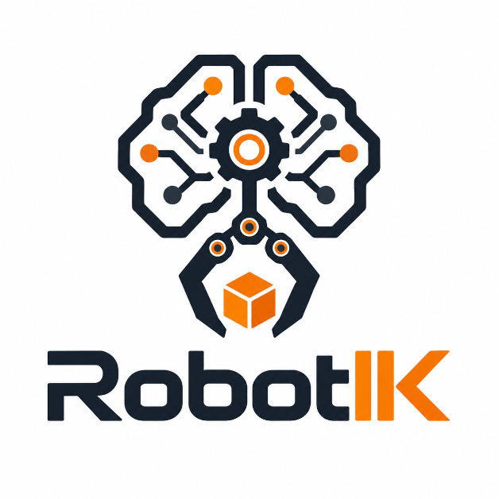

# 🤖 RobotIK

**RobotIK is a lightweight C++20 library for building robots that can be simulated, tested, trained, and eventually driven on real hardware—without rewriting their logic.**

RobotIK is not meant to replace excellent existing robotics libraries. It aims to make them work together behind a simple API. RobotIK started as a personal project to deepen my knowledge of robotics and inverse kinematics (IK), then evolved into a lightweight architecture focused on simulation: a way to explore, with hindsight, how I would organize simulation, tests, and control around a clear API if I were building a robot today.

> **Write a mission once, then run it against a simulated robot or a real one.**

The same behavior can start in a simulator, run headless in CI, feed an RL environment, and later connect to physical hardware. The idea is simple:

> **Active project: the API is still evolving. Scenarios, demos, and tests are the best examples of the current API. Planned integrations include Prolog and PDDL.**

```text
                         Your application
                               │
                               ▼
                         ┌───────────┐
                         │  RobotIK  │
                         └─────┬─────┘
                               │
             ┌─────────────────┼─────────────────┐
             │                 │                 │
          Perception         Skills          Scenarios
             │                 │                 │
          WorldModel      Behavior Tree       Tests
             │                 │
             └────────────┬────┘
                          │
                    Robot / Commands
                          │
              ┌───────────┴───────────┐
              │                       │
           MuJoCo                 Real robot
          simulation              SO-101, ...
```

## ❓ Why RobotIK?

Modern robotics already has strong specialized libraries:

- **Pinocchio** for kinematics and dynamics;
- **MuJoCo** for physics and contact simulation;
- **Ruckig**, **OMPL**, etc. for trajectories and motion planning;
- **OpenCV** for image processing;
- **behaviortree.cpp** for behavior trees (a compact alternative to state machines);
- **RViz** for 3D visualization.

The interesting problem is not rewriting all of that, but:

> **How do you build a simple autonomous robot by combining these building blocks?**

RobotIK provides that orchestration layer and builds on [Pinocchio](https://github.com/stack-of-tasks/pinocchio), [MuJoCo](https://github.com/google-deepmind/mujoco), and other projects of mine:

- [Compages](https://github.com/Lecrapouille/Compages) — a 3D engine split into three layers: ECS world, 3D rendering, and an OpenGL abstraction (shaders, CPU→GPU uploads).
- [BlackThorn](https://github.com/Lecrapouille/BlackThorn) — a behavior-tree library designed to be clearer and faster than mainstream behaviortree.cpp.

Some perception demos require OpenCV and AprilTag.

---

## 🛠️ A concrete example

Imagine a 6-DOF arm that must pick a red cube and place it in a box. You want to express:

```text
Detect the cube
→ approach
→ reach the cube
→ grasp
→ lift the cube
→ move to the box
→ release
→ verify the cube is in the box
```

RobotIK breaks this mission into several levels:

```text
Mission
   │
   ▼
Behavior Tree
   │
   ├── Detect(red_cube)
   ├── Approach(red_cube)
   ├── Reach(red_cube)
   ├── Grasp(red_cube)
   ├── MoveTo(box)
   └── Release(red_cube)
          │
          ▼
       Skills
          │
          ▼
     Actuators
          │
          ▼
       Robot
```

A `Skill` does not need to know whether the robot is simulated. In RobotIK, a **`Skill`** is the unit of action between the behavior tree and the robot.

```text
MoveTCP(target)
       │
       ▼
   RobotIK API
       │
       ├───────────────┐
       ▼               ▼
    MuJoCo          SO-101
   simulation        real
```

---

## 🧪 A mission can be a test

A RobotIK scenario file describes not only the world and how the robot should behave, but also **how to tell whether the mission succeeded**—a contract that doubles as an integration test.

For example:

```yaml
assert:
  - robot.success
  - object("red_cube").inside("box")
  - gripper.empty
  - collisions == 0
  - time < 30
```

The same mission can be used as:

- a demo;
- a regression test;
- a benchmark;
- a perception experiment;
- a learning environment;
- a test bed for a new planning strategy.

> **This part is still MVP-quality. Future work includes a proper assertion grammar and/or integration with tools such as OpenScenario.**

---

## 🏭 Simulation or real robot?

This is a central idea in RobotIK. A skill must not contain:

```cpp
if (mujoco)
{
    ...
}
else if (so101)
{
    ...
}
```

It should drive the robot through a common API:

```cpp
robot.joint("shoulder").moveTo(target);
robot.gripper().open();
```

Behind that API, a `RobotBackend` can be plugged in:

```text
RobotBackend
   │
   ├── MujocoBackend
   ├── SO101Backend       ← future
   └── other robot        ← future
```

The backend translates RobotIK commands to the simulator or hardware. That also enables a **digital twin** in Compages: the real robot publishes state, RobotIK updates the world, and Compages renders it.

> **Note: no physical robot has been controlled with this library yet.**

---

## 🏗️ Architecture (work in progress)

```text
                         RobotIK
                            │
       ┌────────────────────┼────────────────────┐
       │                    │                    │
 Robot / State          Autonomy            Scenarios
       │                    │                    │
       │              ┌─────┼─────┐              │
       │              │     │     │              │
       │             GOAP  PDDL  LLM             │
       │              │     │     │              │
       │              └─────┼─────┘              │
       │                    ▼                    │
       │              Behavior Tree              │
       │                    │                    │
       │                  Skills                 │
       │                    │                    │
       └─────────────── Robot API ───────────────┘
                            │
                            ▼
                 ┌──────────┴──────────┐
                 │                     │
              MuJoCo               Hardware
                 │                     │
              Physics              SO-101...
```

The planning side is intentionally extensible. The long-term goal includes:

- **PDDL** or **GOAP** for symbolic planning and action sequences;
- **Prolog** to express and query world logic;
- **LLM** to interpret intent or propose high-level plans;
- **Behavior trees** to turn plans into reactive execution.

One possible flow:

```text
"Pick the red cube and put it in the box"
                  │
                  ▼
             LLM / user
                  │
                  ▼
           GOAP / PDDL planner
                  │
            symbolic plan
                  │
                  ▼
          Behavior Tree
                  │
                  ▼
                Skills
                  │
                  ▼
        control / motion
```

Prolog can run in parallel to answer questions such as:

```text
inside(red_cube, box).
reachable(arm, red_cube).
holding(gripper, red_cube).
```

None of these technologies is mandatory; they are interchangeable bricks.

---

## 👁️ Perception

A RobotIK camera must not force OpenCV into the core library. The pattern is:

```text
Camera
  │
  ▼
FrameSource
  │
  ▼
PerceptionPipeline
  │
  ├── Detector
  ├── Detector
  └── DepthEstimator
        │
        ▼
    WorldModel
```

For example:

```cpp
pipeline
    .add<ColorDetector>()
    .add<AprilTagDetector>()
    .add<DepthEstimator>();
```

Applications may use OpenCV, AprilTag, or other libraries. RobotIK core stays independent of rendering and image processing.

---

## 🧩 Scenarios: the experimental core

RobotIK uses declarative scenarios.

Example:

```yaml
scenario: pick_and_place
seed: 42

robot:
  model: robot_6axis.urdf

world:
  objects:
    red_cube:
      type: cube
      position: [0.40, 0.20, 0.02]
    box:
      type: box
      position: [0.40, -0.20, 0.04]

execute:
  task: Pick the red cube and put it in the box.
  behavior_tree: pick_and_place.bt.yml

assert:
  - robot.success
  - object("red_cube").inside("box")
  - gripper.empty
  - collisions == 0
```

The scenario does not spell out kinematics details; it describes **what you want to experiment with and verify**.

---

## 🌀 Reproducibility

Robotics experiments are hard to reproduce when randomness is involved:

- initial poses;
- sensor noise;
- faults;
- RL policy;
- environment.

RobotIK uses a master seed:

```yaml
seed: 42
```

It can feed the various random generators:

```text
seed = 42
     │
     ├── world
     ├── sensors
     ├── faults
     └── RL run
```

That helps debugging: the same seed should yield the same experiment under identical conditions.

---

## 🏆 Reinforcement learning

RobotIK provides an `Environment` abstraction and an `EnvironmentPool`. You can run:

```text
Environment 0 ─┐
Environment 1 ─┤
Environment 2 ─┤
Environment 3 ─┼──▶ RL policy
...            │
Environment N ─┘
```

without opening N windows. Rendering is an optional observation path for the user, not a core dependency. That keeps the loop:

```text
observation
    ↓
policy
    ↓
action
    ↓
physics
    ↓
reward
    ↓
observation
```

independent of environment count and thread count.

---

## ⚖️ RobotIK and SkiROS2

RobotIK may look close to **SkiROS2**—both use skills, behavior trees, planning, and world knowledge.

The positioning differs.

**SkiROS2** is a robot control platform on ROS 2, with a semantic world model, skills with pre/post-conditions, behavior trees, and task planning. It fits distributed robotic systems in the ROS ecosystem well.

RobotIK targets writing robotic programs in C++ without adopting a full middleware stack. Another emphasis is symmetry:

```text
             same mission
                  │
        ┌─────────┴─────────┐
        ▼                   ▼
     simulation          hardware
        │                   │
      MuJoCo             SO-101
```

---

## 🚀 Clone, build, and run

**Note:** RobotIK does not use CMake and does not build on macOS (OpenGL > 4.1 requirement).

```bash
git clone https://github.com/Lecrapouille/RobotIK --recurse-submodules
cd RobotIK

make download-external-libs
make compile-external-libs
make -j"$(nproc --all)"
```

A `build` directory should contain static and shared libraries plus executables:

```bash
./build/RobotIK-Simulator data/scenarios/pick_and_place.yml
```

Headless:

```bash
./build/RobotIK-Headless data/scenarios/pick_and_place.yml --seed 7
```

Parallel RL demo:

```bash
./build/RobotIK-PickAndPlaceRL \
    --policy converged \
    --envs 16 \
    --threads 8 \
    --episodes 32
```

Optional install:

```bash
sudo make install
```

For developers, unit tests:

```bash
make tests -j"$(nproc --all)"
```

---

## 📚 Documentation

| Document | Contents |
|----------|----------|
| [doc/README.md](doc/README.md) | Reading order, beginner → advanced |
| [doc/Scenario-et-Simulation.md](doc/Scenario-et-Simulation.md) | YAML scenarios, seeds, faults, simulation, assertions |
| [doc/BehaviorTree-et-Skills.md](doc/BehaviorTree-et-Skills.md) | BlackThorn actions, `SkillScheduler`, skills |
| [doc/Architecture-Robotik.md](doc/Architecture-Robotik.md) | Layers, data flow, `include/Robotik/` layout |
| [doc/Demos.md](doc/Demos.md) | Simulator, Headless, LineFollower, PickAndPlace RL |

---

## 📝 License

See `LICENSE`.
