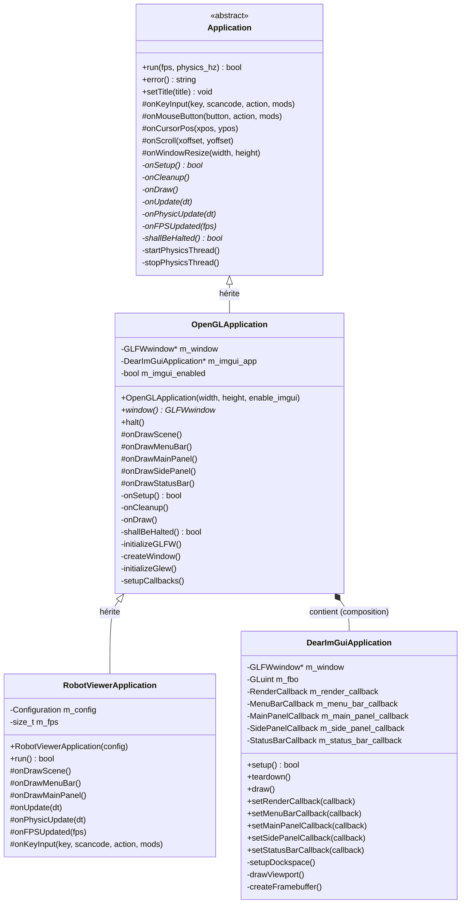

# Architecture du Viewer Robotik

Ce document décrit l'architecture modulaire du système de visualisation 3D pour robots, basée sur OpenGL et Dear ImGui.

## Vue d'ensemble

L'architecture est conçue pour simplifier la création d'applications de visualisation 3D avec interface utilisateur, en cachant la complexité de la gestion de fenêtres OpenGL et de l'intégration ImGui.

## Hiérarchie des classes



## Architecture détaillée

### 1. Application (Classe de base abstraite)

**Responsabilités :**
- Gestion de la boucle principale de l'application
- Gestion du thread de physique séparé
- Calcul et mise à jour des FPS
- Définition de l'interface que les applications dérivées doivent implémenter

**Méthodes virtuelles à implémenter :**
- `onSetup()` : Initialisation de l'application
- `onCleanup()` : Nettoyage des ressources
- `onDraw()` : Rendu de chaque frame
- `onUpdate(dt)` : Mise à jour logique
- `onPhysicUpdate(dt)` : Mise à jour physique (thread séparé)
- `onFPSUpdated(fps)` : Notification de changement de FPS
- `shallBeHalted()` : Test de fermeture de l'application

**Méthodes virtuelles optionnelles (protégées) :**
- `onKeyInput()` : Gestion des événements clavier
- `onMouseButton()` : Gestion des boutons de souris
- `onCursorPos()` : Gestion du mouvement de la souris
- `onScroll()` : Gestion de la molette de la souris
- `onWindowResize()` : Gestion du redimensionnement de la fenêtre

### 2. OpenGLApplication (Classe intermédiaire)

**Responsabilités :**
- Création et gestion de la fenêtre OpenGL via GLFW
- Initialisation d'OpenGL et GLEW
- Intégration optionnelle de Dear ImGui pour l'interface utilisateur
- Configuration des callbacks GLFW
- Gestion du cycle de rendu OpenGL/ImGui

**Caractéristiques :**
- Hérite de `Application`
- Contient un `DearImGuiApplication` optionnel (composition)
- Cache toute la complexité de l'initialisation OpenGL/ImGui
- Fournit des méthodes virtuelles spécifiques à l'UI

**Méthodes virtuelles optionnelles (protégées) :**
- `onDrawScene()` : Rendu de la scène 3D
- `onDrawMenuBar()` : Rendu de la barre de menu ImGui
- `onDrawMainPanel()` : Rendu du panneau principal ImGui
- `onDrawSidePanel()` : Rendu du panneau latéral ImGui
- `onDrawStatusBar()` : Rendu de la barre de statut ImGui

### 3. DearImGuiApplication (Classe utilitaire)

**Responsabilités :**
- Initialisation et gestion du contexte Dear ImGui
- Gestion du docking et des viewports multiples
- Création et gestion du framebuffer pour le rendu 3D
- Gestion du layout de l'interface utilisateur

**Caractéristiques :**
- Utilisée en composition par `OpenGLApplication`
- Système de callbacks pour permettre l'injection de code UI personnalisé
- Gestion automatique du viewport 3D dans une fenêtre ImGui

### 4. RobotViewerApplication (Classe d'application concrète - Exemple)

**Responsabilités :**
- Implémentation spécifique pour la visualisation de robots
- Rendu de la scène 3D
- Interface utilisateur personnalisée

**Caractéristiques :**
- Hérite de `OpenGLApplication`
- Implémente uniquement les méthodes nécessaires
- Code minimal et focalisé sur la logique métier

## Exemple d'utilisation

### Exemple minimal sans ImGui

```cpp
#include "Viewer/OpenGLApplication.hpp"
#include <GL/glew.h>

class SimpleViewer : public robotik::viewer::OpenGLApplication
{
public:
    SimpleViewer()
        : OpenGLApplication(800, 600, false) // ImGui désactivé
    {
        setTitle("Simple OpenGL Viewer");
    }

protected:
    void onDrawScene() override
    {
        // Rendu OpenGL simple
        glClearColor(0.2f, 0.3f, 0.4f, 1.0f);
        glClear(GL_COLOR_BUFFER_BIT | GL_DEPTH_BUFFER_BIT);

        // ... votre code de rendu 3D ici ...
    }

    void onKeyInput(int key, int /*scancode*/, int action, int /*mods*/) override
    {
        if (action == GLFW_PRESS && key == GLFW_KEY_ESCAPE)
        {
            halt();
        }
    }

    void onUpdate(float dt) override
    {
        // Mise à jour de la logique
    }

    void onPhysicUpdate(float dt) override
    {
        // Mise à jour de la physique
    }

    void onFPSUpdated(size_t fps) override
    {
        setTitle("Simple Viewer - FPS: " + std::to_string(fps));
    }
};

int main()
{
    SimpleViewer app;
    app.run(60, 100); // 60 FPS, 100 Hz physique
    return 0;
}
```

### Exemple complet avec ImGui

```cpp
#include "Viewer/OpenGLApplication.hpp"
#include <GL/glew.h>
#include <imgui.h>

class RobotViewer : public robotik::viewer::OpenGLApplication
{
public:
    RobotViewer()
        : OpenGLApplication(1280, 720, true) // ImGui activé
    {
        setTitle("Robot Viewer");
    }

protected:
    // Rendu de la scène 3D
    void onDrawScene() override
    {
        glClearColor(0.1f, 0.1f, 0.1f, 1.0f);
        glClear(GL_COLOR_BUFFER_BIT | GL_DEPTH_BUFFER_BIT);

        // Rendu du robot
        drawRobot();
        drawGrid();
    }

    // Menu bar personnalisé
    void onDrawMenuBar() override
    {
        if (ImGui::BeginMenu("File"))
        {
            if (ImGui::MenuItem("Load Robot..."))
            {
                // Ouvrir dialogue de chargement
            }
            ImGui::Separator();
            if (ImGui::MenuItem("Quit", "Esc"))
            {
                halt();
            }
            ImGui::EndMenu();
        }

        if (ImGui::BeginMenu("View"))
        {
            ImGui::Checkbox("Show Grid", &m_show_grid);
            ImGui::Checkbox("Show Axes", &m_show_axes);
            ImGui::EndMenu();
        }
    }

    // Panneau de contrôle principal
    void onDrawMainPanel() override
    {
        ImGui::Begin("Robot Control");

        ImGui::Text("Joint Control");
        ImGui::Separator();

        for (size_t i = 0; i < m_joint_angles.size(); ++i)
        {
            std::string label = "Joint " + std::to_string(i + 1);
            ImGui::SliderFloat(label.c_str(), &m_joint_angles[i],
                              -3.14f, 3.14f, "%.2f rad");
        }

        ImGui::Spacing();
        if (ImGui::Button("Reset Pose"))
        {
            resetPose();
        }

        ImGui::End();
    }

    // Panneau latéral pour les infos
    void onDrawSidePanel() override
    {
        ImGui::Begin("Information");

        ImGui::Text("Robot: %s", m_robot_name.c_str());
        ImGui::Text("DOF: %zu", m_joint_angles.size());
        ImGui::Separator();

        ImGui::Text("Camera");
        ImGui::Text("Position: (%.2f, %.2f, %.2f)",
                   m_camera_pos.x, m_camera_pos.y, m_camera_pos.z);

        ImGui::End();
    }

    // Barre de statut
    void onDrawStatusBar() override
    {
        ImGui::Begin("Status Bar");
        ImGui::Text("Ready | FPS: %zu", m_current_fps);
        ImGui::End();
    }

    // Gestion des événements
    void onKeyInput(int key, int /*scancode*/, int action, int /*mods*/) override
    {
        if (action == GLFW_PRESS)
        {
            switch (key)
            {
                case GLFW_KEY_ESCAPE:
                    halt();
                    break;
                case GLFW_KEY_R:
                    resetPose();
                    break;
                case GLFW_KEY_G:
                    m_show_grid = !m_show_grid;
                    break;
            }
        }
    }

    void onUpdate(float dt) override
    {
        // Mise à jour de l'animation
        updateRobotAnimation(dt);
    }

    void onPhysicUpdate(float dt) override
    {
        // Mise à jour de la simulation physique
        updateRobotPhysics(dt);
    }

    void onFPSUpdated(size_t fps) override
    {
        m_current_fps = fps;
        setTitle("Robot Viewer - FPS: " + std::to_string(fps));
    }

private:
    void drawRobot() { /* ... */ }
    void drawGrid() { /* ... */ }
    void resetPose() { /* ... */ }
    void updateRobotAnimation(float dt) { /* ... */ }
    void updateRobotPhysics(float dt) { /* ... */ }

    std::string m_robot_name = "MyRobot";
    std::vector<float> m_joint_angles = {0.0f, 0.0f, 0.0f, 0.0f, 0.0f, 0.0f};
    struct { float x, y, z; } m_camera_pos = {5.0f, 5.0f, 5.0f};
    bool m_show_grid = true;
    bool m_show_axes = true;
    size_t m_current_fps = 0;
};

int main()
{
    RobotViewer app;
    if (!app.run(60, 100)) // 60 FPS affichage, 100 Hz physique
    {
        std::cerr << "Error: " << app.error() << std::endl;
        return 1;
    }
    return 0;
}
```

## Avantages de cette architecture

### 1. Séparation des responsabilités
- `Application` : Gestion de la boucle principale et du threading
- `OpenGLApplication` : Gestion d'OpenGL et de la fenêtre
- `DearImGuiApplication` : Gestion de l'interface utilisateur
- Application utilisateur : Logique métier uniquement

### 2. Simplicité d'utilisation
- Pas de gestion manuelle de GLFW, GLEW, ou ImGui
- Pas de std::bind ni de lambdas complexes pour les callbacks
- Méthodes virtuelles claires et intuitives
- Implémentations par défaut pour toutes les méthodes optionnelles

### 3. Modularité de l'UI
- Chaque partie de l'interface (menu, panneaux, etc.) a sa propre méthode
- Évite le code monolithique dans une seule fonction de rendu UI
- Facile d'ajouter ou de retirer des éléments d'interface

### 4. Flexibilité
- ImGui peut être complètement désactivé si non nécessaire
- Toutes les méthodes virtuelles sont optionnelles
- Support du threading physique intégré
- Gestion automatique des FPS

### 5. Extensibilité
- Facile d'ajouter de nouvelles méthodes virtuelles
- Possibilité de créer des classes intermédiaires pour des cas d'usage spécifiques
- Architecture ouverte à l'ajout de nouveaux systèmes de rendu

## Points d'extension

### Ajouter un nouveau type d'application

Pour créer un nouveau type d'application spécialisée, héritez simplement de `OpenGLApplication` :

```cpp
class PhysicsSimulatorApp : public robotik::viewer::OpenGLApplication
{
    // Votre implémentation spécifique
};
```

### Personnaliser le comportement d'OpenGL

Si vous avez besoin d'un contrôle plus fin sur l'initialisation OpenGL, vous pouvez créer une classe intermédiaire :

```cpp
class CustomOpenGLApplication : public robotik::viewer::OpenGLApplication
{
protected:
    bool onSetup() override
    {
        if (!OpenGLApplication::onSetup())
            return false;

        // Vos configurations OpenGL personnalisées
        glEnable(GL_MULTISAMPLE);
        glEnable(GL_CULL_FACE);
        // ...

        return true;
    }
};
```

### Ajouter de nouveaux panneaux ImGui

L'architecture supporte facilement l'ajout de nouveaux types de panneaux en ajoutant de nouvelles méthodes virtuelles dans `OpenGLApplication` et les callbacks correspondants dans `DearImGuiApplication`.

## Migration depuis l'ancienne API

### Avant (Ancienne API)

```cpp
class MyApp : public Application
{
    OpenGLWindow m_window;
    std::unique_ptr<DearImGuiApplication> m_imgui_app;

    bool onSetup() override
    {
        if (!m_window.initialize(/* callbacks avec std::bind */))
            return false;

        m_imgui_app = std::make_unique<DearImGuiApplication>(800, 600);
        m_imgui_app->setup();
        m_imgui_app->setRenderCallback([this]() { render3DScene(); });
        // ...
    }

    void onDraw() override
    {
        m_window.pollEvents();
        m_imgui_app->draw();
        m_window.swapBuffers();
    }

    void render3DScene() { /* ... */ }
};
```

### Après (Nouvelle API)

```cpp
class MyApp : public OpenGLApplication
{
    MyApp() : OpenGLApplication(800, 600, true) {}

    void onDrawScene() override
    {
        // Rendu 3D (ancien render3DScene)
    }

    void onDrawMenuBar() override
    {
        // Menu personnalisé
    }
};
```

## Conclusion

Cette architecture offre un équilibre optimal entre simplicité d'utilisation et flexibilité. Elle cache la complexité technique tout en permettant une personnalisation complète quand nécessaire. Le code utilisateur reste focalisé sur la logique métier, tandis que toute la plomberie OpenGL/ImGui est gérée automatiquement.

