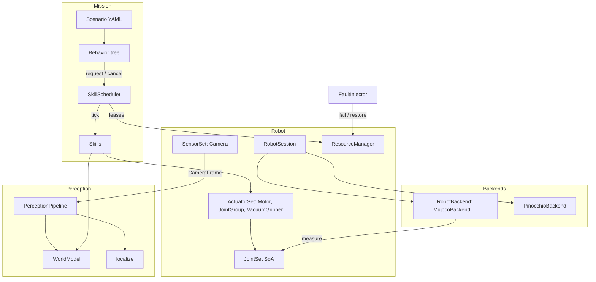

# Architecture `include/Robotik/`

Robotik s’appuie sur **Compages** (`World`, entités, transforms), **Pinocchio** (cinématique), **MuJoCo** (dynamique) et **BlackThorn** (behavior trees). L’API publique vit sous `include/Robotik/`, les implémentations sous `src/Robotik/`. La bibliothèque ne dépend ni d’OpenCV ni d’un moteur de rendu : les images sont des `robotik::Image` (octets contigus) et le rendu passe par l’interface `SceneView`, implémentée par les applications.

Liens entre les bibliothèques tierces : [Ecosysteme.md](Ecosysteme.md).

## Vue d’ensemble



Un pas de `Simulation::step(dt)` :

1. **FaultInjector** — pannes programmées et aléatoires (ressources indisponibles).
2. **Behavior tree** — chaque action demande ou annule une skill au scheduler.
3. **SkillScheduler** — annulations, ressources perdues, admission par priorité (préemption éventuelle), puis tick des skills actives.
4. **RobotSession::step** — actionneurs en panne désactivés, backend (MuJoCo : PD 1 kHz + intégration), cinématique Pinocchio, transforms Compages, capteurs disponibles (caméra → perception → `WorldModel`).
5. **GraspSystem** — physique simplifiée de la ventouse.

---

## Rôle de chaque dossier

| Dossier | Rôle | Fichiers repères |
|---------|------|------------------|
| `Math/` | `Vector3`, `Quaternion`, `Pose` (SI, double) ; `Seed` / `Random` (hiérarchie de seeds rejouables). | `Pose.hpp`, `Random.hpp` |
| `Robot/` | **API robot** : `Robot` (joints, capteurs, actionneurs, ressources, IK), `RobotSession` (pas de temps), `RobotBackend`, `SceneView`, `JointSet` (SoA). | `Robot.hpp`, `Joints.hpp`, `Devices.hpp` |
| `Sensors/` | `Sensor`, `Camera` (+ `CameraIntrinsics`, `CameraFrame`, `FrameSource`), `Image`. | `Camera.hpp`, `Image.hpp` |
| `Actuators/` | `Motor`, `JointGroup`, `VacuumGripper`. | `Actuator.hpp` |
| `Perception/` | `Detection(s)`, `Detector`, `PerceptionPipeline`, `DepthEstimator`, `WorldModel`, `Landmark` / `localize`. | `Detector.hpp`, `WorldModel.hpp`, `Localization.hpp` |
| `Runtime/` | `ResourceManager` / `ResourceLease`, `SkillScheduler`, `FaultInjector`, `RobotContext`, `Simulation`. | `Resources.hpp`, `Scheduler.hpp`, `Faults.hpp`, `Simulation.hpp` |
| `Skills/` | Interface `Skill` + `SkillDescription` (ressources, priorité, préconditions) ; skills de mouvement et de pick-and-place. | `Skill.hpp`, `MotionSkills.hpp`, `PickPlaceSkills.hpp` |
| `Behavior/` | Pont BlackThorn : `registerSkills(factory, scheduler)`. | `SkillNodes.hpp` |
| `Scenario/` | Mission YAML : seed, capteurs, actionneurs, objets, randomisation, pannes, BT, assertions. | `Scenario.hpp` |
| `Environment/` | Apprentissage par renforcement : `Environment`, `EnvironmentPool` (N environnements en parallèle). | `Environment.hpp` |
| `Backends/` | `PinocchioBackend` (FK/IK), `MujocoBackend` (dynamique, implémente `RobotBackend`). | `PinocchioBackend.hpp`, `MujocoBackend.hpp` |
| `Systems/` | `GraspSystem` (ventouse). | `GraspSystem.hpp` |
| `ECS/` | Composants restants dans Compages : `SceneObject`, `RobotTag`, `RobotIdentity`. | `ObjectComponents.hpp` |

En-tête parapluie : `Robotik/Robotik.hpp`.

---

## Choix de conception

### Cache friendly

- **`JointSet`** stocke chaque grandeur dans son propre tableau (positions, vitesses, efforts, cibles, modes, gains…) indexé par `JointId` (`uint16_t`). Les boucles de contrôle et la copie vers Pinocchio/MuJoCo parcourent des tableaux contigus ; `positions()` / `velocities()` / `efforts()` sont des `std::span`.
- **`ResourceManager`** : tableaux parallèles (nom, disponible, propriétaire, nombre d’utilisateurs). Un `ResourceLease` garde ses réservations dans un tableau fixe de 8 éléments, sans allocation.
- **`SkillScheduler`** : états, raisons, bloqueurs et baux dans des tableaux parallèles indexés par `SkillId`.
- **`EnvironmentPool`** : actions, observations, récompenses et fins d’épisode dans quatre buffers plats `float` / `uint8_t`, prêts à passer à un réseau.
- Les images sont un seul buffer d’octets ; les caméras réutilisent leur allocation d’une image à l’autre.

### Robot, capteurs, actionneurs, ressources

Chaque capteur et chaque actionneur ajouté au robot devient une **ressource du même nom** :

```cpp
auto& camera = robot.sensors().add<robotik::Camera>("wrist_camera",
                                                    robotik::CameraConfig{ .parent = "link6" });
auto& arm = robot.actuators().add<robotik::JointGroup>("arm");
auto& gripper = robot.actuators().add<robotik::VacuumGripper>("gripper");
```

Une ressource en panne (`resources().fail("wrist_camera")`) est simplement **indisponible** : la caméra ne produit plus d’images, un actionneur est désactivé (`disable`) à chaque pas, une skill qui en a besoin ne démarre pas (`Unavailable`) ou s’arrête (`ResourceLost`).

### Backend et rendu hors bibliothèque

- `RobotBackend` (`attach`, `reset`, `step`) : MuJoCo en simulation ; un driver matériel ou un backend cinématique (démo LineFollower) implémentent la même interface.
- `SceneView` : le simulateur charge les meshes, dessine les objets et rend les caméras (Compages + OpenGL). Sans vue, la simulation est headless ; le `WorldModel` reçoit alors la vérité terrain (oracle).

---

## Structures importantes

| Type | Fichier | Rôle |
|------|---------|------|
| `Robot` / `RobotSession` | `Robot/Robot.hpp` | Le robot et sa boucle (`connect(backend)`, `hold(posture)`, `step(dt)`, `reset()`). |
| `JointSet` | `Robot/Joints.hpp` | État et commandes des joints (SoA, SI). `moveTo`, `spin`, `push`, `hold`, `control(dt)`. |
| `Camera` | `Sensors/Camera.hpp` | Fréquence, bruit seedé, `FrameSource` (rendu fourni par l’application), `onFrame`. |
| `PerceptionPipeline` | `Perception/Detector.hpp` | Étapes `Detector` interchangeables (couleur, AprilTag, ligne, profondeur…). |
| `WorldModel` | `Perception/WorldModel.hpp` | Croyances sur les objets (repère base), relèvement monoculaire, porte de plausibilité (`gate`). |
| `ResourceManager` | `Runtime/Resources.hpp` | Réservations partagées/exclusives RAII, pannes. |
| `SkillScheduler` | `Runtime/Scheduler.hpp` | Admission, priorités, préemption, annulation coopérative, trace. |
| `FaultInjector` | `Runtime/Faults.hpp` | Pannes programmées et de Poisson, rejouables par seed. |
| `Seed` / `Random` | `Math/Random.hpp` | `seed.derive("world")`, `seed.derive(index)` : une graine par sous-système. |
| `Simulation` | `Runtime/Simulation.hpp` | Mission complète à partir d’un `Scenario`. |
| `EnvironmentPool` | `Environment/Environment.hpp` | N environnements RL, auto-reset, résultats identiques quel que soit le nombre de threads. |

---

## Où commencer en code

1. Lire un scénario : [Scenario-et-Simulation.md](Scenario-et-Simulation.md).
2. Comprendre BT, scheduler et skills : [BehaviorTree-et-Skills.md](BehaviorTree-et-Skills.md).
3. Exemples complets : `src/Applications/Headless/main.cpp`, `src/Applications/Demos/LineFollower/main.cpp`, `src/Applications/Demos/PickAndPlaceRL/`.
4. Ajouter une capacité : une classe `Skill`, une `SkillDescription` (ressources, priorité, préconditions), `scheduler.add<MaSkill>(description, ...)`, puis `registerSkills` l’expose au behavior tree sous son nom.
