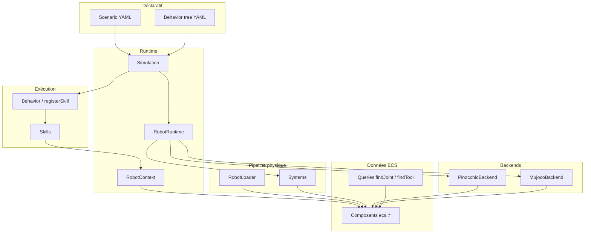

# Architecture `include/Robotik/`

Robotik s’appuie sur **Compages** (`World`, entités, transforms), **Pinocchio** (cinématique), **MuJoCo** (dynamique), **BlackThorn** (behavior trees). Le code public vit surtout sous `include/Robotik/` ; les implémentations sont dans `src/Robotik/`.

Liens entre les quatre bibliothèques tierces : [Ecosysteme.md](Ecosysteme.md).

## Vue d’ensemble

Ordre typique d’un pas de simulation (`RobotRuntime::pipeline`) :

1. **ControllerSystem** — `JointCommand` → efforts (`ActuatorCommand`).
2. **MujocoSyncSystem** — écrit les commandes, **MuJoCo** intègre, relit `JointState`.
3. **PinocchioSyncSystem** + **JointProjectionSystem** — FK / projection sur la hiérarchie Compages.
4. Côté mission : **Simulation** tick le BT → **Skills** mettent à jour l’ECS ; **GraspSystem** suit les objets saisis.

---

## Rôle de chaque dossier

| Dossier | Rôle | Fichiers repères |
|---------|------|------------------|
| [`Backends/`](../../include/Robotik/Backends/) | Adaptateurs **Pinocchio** et **MuJoCo** : un URDF, API stable (FK, IK, `step`, indices joints). Pas des composants ECS. | `PinocchioBackend.hpp`, `MujocoBackend.hpp` |
| [`Model/`](../../include/Robotik/Model/) | **Chargement URDF** dans Compages + pose des composants ECS et bindings backends sur les liens. | `RobotLoader.hpp` |
| [`ECS/`](../../include/Robotik/ECS/) | **Composants** sur les entités Compages : joints, contrôle, robot, objets, perception, liaisons backend. | `JointComponents.hpp`, `RobotComponents.hpp`, `ObjectComponents.hpp`, `Queries.hpp` |
| [`Systems/`](../../include/Robotik/Systems/) | **Systèmes** stateless : une passe sur le `World` (PD, sync MuJoCo/Pinocchio, projection, grasp). | `ControllerSystem.hpp`, `MujocoSyncSystem.hpp`, `GraspSystem.hpp` |
| [`Skills/`](../../include/Robotik/Skills/) | **Comportements** impératifs : une classe par capacité, `tick(RobotContext, Seconds)` → `Status`. | `Skill.hpp`, `MoveJointSkill.hpp`, `PickPlaceSkills.hpp` |
| [`Behavior/`](../../include/Robotik/Behavior/) | **Pont BlackThorn** : enregistre une skill comme action BT, trace (`SkillTrace`), conversion `Status` ↔ `bt::Status`. | `SkillNodes.hpp` |
| [`Runtime/`](../../include/Robotik/Runtime/) | **Boucle de simu** : `RobotRuntime`, `Simulation`, contexte par tick, statuts skills. | `RobotRuntime.hpp`, `Simulation.hpp`, `RobotContext.hpp` |
| [`Scenario/`](../../include/Robotik/Scenario/) | **Mission YAML** parsée : robot, objets, BT, assertions. | `Scenario.hpp` |

Dossiers voisins (hors liste demandée) : `Perception/` (`ColorDetector`), `Robotik.hpp` (umbrella).

---

## Structures importantes

### Runtime et mission

| Type | Fichier | Rôle |
|------|---------|------|
| **`Scenario`** | `Scenario/Scenario.hpp` | Contenu d’un YAML : `robot_model`, `home`, `objects`, `behavior_tree`, `asserts`. |
| **`Simulation`** | `Runtime/Simulation.hpp` | Instance de mission : crée `RobotRuntime`, spawn, enregistre les skills, charge le BT, `step` / `checks`. |
| **`RobotRuntime`** | `Runtime/RobotRuntime.hpp` | Propriétaire Pinocchio + MuJoCo, `hold`, `step`, pipeline physique. |
| **`RobotContext`** | `Runtime/RobotContext.hpp` | Snapshot par tick : `world`, `kinematics`, `simulation`, `time`, `dt`. Passé aux skills. |
| **`Status`** | `Runtime/Status.hpp` | `IDLE`, `RUNNING`, `SUCCESS`, `FAILURE` — retour skill et mapping BT. |
| **`JointGoal` / `JointPosture`** | `RobotContext.hpp` | `variant<Radians, Length>` par nom de joint ; `hold`, `MoveJointsSkill`. |

### Comportement

| Type | Fichier | Rôle |
|------|---------|------|
| **`Skill`** | `Skills/Skill.hpp` | Interface abstraite `tick` + `reset`. |
| **`SkillTrace`** | `Behavior/SkillNodes.hpp` | Historique des runs d’actions BT (frise UI, headless). |
| **`registerSkill`** | `Behavior/SkillNodes.hpp` | Lie un nom YAML à une `shared_ptr<Skill>`. |

### Backends

| Type | Fichier | Rôle |
|------|---------|------|
| **`PinocchioBackend`** | `Backends/PinocchioBackend.hpp` | Modèle analytique, `framePose`, `solveIK`, vecteur `q`. |
| **`MujocoBackend`** | `Backends/MujocoBackend.hpp` | `step(Seconds)`, `qpos` / `qvel`, contacts, forces appliquées. |
| **`Pose`** | `PinocchioBackend.hpp` | Cible cartésienne (m + quaternion) pour IK / skills TCP. |

### ECS — groupes de composants

Les composants sont des **structs POD** sur les entités-liens ou caméra ; pas de logique.

| Fichier | Contenu principal |
|---------|-------------------|
| **`JointComponents.hpp`** | `Joint`, `JointState`, `JointCommand`, `JointLimits`, `HomePosition`, `JointControlMode`. |
| **`ActuatorComponents.hpp`** | `ActuatorCommand`, `PositionController`, `VelocityController`. |
| **`RobotComponents.hpp`** | `RobotTag`, `Link`, `EndEffector`, `Gripper` (mâchoires). |
| **`ObjectComponents.hpp`** | `SceneObject`, `VacuumGripper` (ventouse). |
| **`BackendComponents.hpp`** | `MujocoJointBinding`, `PinocchioJointBinding`, actuateurs MuJoCo. |
| **`PerceptionComponents.hpp`** | `CameraSensor`, `DetectedObjects`, `Detection`. |
| **`Queries.hpp`** | `findJoint`, `findObject`, `findTool` (helpers inline). |

Convention actuelle : champs **généralisés** joint (`JointState::position`, etc.) en `double` SI (rad ou m selon le joint URDF) ; longueurs et temps typés via **`Length`**, **`Seconds`**, **`Radians`** où l’API l’exige.

### Model et systems

| Type | Rôle |
|------|------|
| **`RobotLoader`** | `instantiate(world, scene?, pinocchio, mujoco?, urdf)` — entités Compages + ECS + heuristiques gripper/EE. |
| **`ControllerSystem`** | PD position → `ActuatorCommand`. |
| **`MujocoSyncSystem` / `PinocchioSyncSystem`** | Copie état/commandes entre ECS et backends. |
| **`JointProjectionSystem`** | Aligne transforms Compages avec les joints. |
| **`GraspSystem`** | Objet tenu collé à la ventouse (FK outil). |

---

## Où commencer en code

1. Lire un scénario : [Scenario-et-Simulation.md](Scenario-et-Simulation.md).
2. Comprendre BT vs skills : [BehaviorTree-et-Skills.md](BehaviorTree-et-Skills.md).
3. Suivre un pas : `Simulation::step` → `RobotRuntime::pipeline` → `ControllerSystem` + MuJoCo.
4. Ajouter une capacité : nouvelle classe `Skill`, enregistrement dans `Simulation::buildTree`, action dans le YAML BT.
