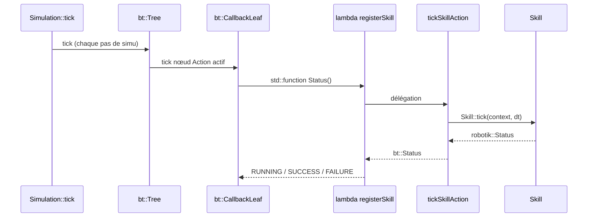

# Behavior tree : Action vs Skill

Dans Robotik, on manipule souvent deux mots proches qui ne désignent **pas** la même couche. Les confondre rend difficile la lecture du YAML et de `registerSkill`.

## Deux vocabulaires

| Terme | Librairie / namespace | Où il apparaît | Rôle |
|-------|--------|----------------|------|
| Behavior tree **Action** | BlackThorn / bt | YAML : `Action: name: Home` | Nœud **feuille** de l’arbre. L’interpréteur BT l’appelle à chaque tick tant qu’il est actif. Retourne `RUNNING`, `SUCCESS` ou `FAILURE`. |
| Robot **Skill** | Robotik / robotik | C++ : `HomeSkill`, `GraspSkill`, … | Unité de **comportement robot** : lit l’ECS via `RobotContext`, écrit des `JointCommand`, etc. Retourne `robotik::Status` (`RUNNING`, `SUCCESS`, `FAILURE`). |

En bref :

- L’**action** est le **nom et le slot** dans l’arbre (déclaratif, YAML).
- La **skill** est le **code** qui fait bouger le robot (impératif, C++).

Une action du BT ne « contient » pas magiquement une skill : on **lie** explicitement le nom YAML à une instance C++ avec `registerSkill`.

## Chaîne d’exécution



Il n’y a pas de troisième callback cachée :

1. `NodeFactory::registerAction` stocke ta lambda dans un `bt::CallbackLeaf` (voir `external/BlackThorn/.../Builder/Factory.hpp`).
2. Au chargement du YAML, `Action: name: Home` instancie le nœud enregistré sous `"Home"`.
3. La lambda passée à `registerSkill` **est** le point d’entrée BT ; elle appelle `tickSkillAction`, qui appelle `Skill::tick`.

## Enregistrement : `registerSkill`

Signature : `include/Robotik/Behavior/SkillNodes.hpp`.

**Quand** : avant `bt::Builder::fromFile`, pendant la construction de la factory (ex. `Simulation::buildTree` dans `src/Robotik/Runtime/Simulation.cpp`).

**Quoi** :

- `@p_name` doit correspondre **exactement** au `name:` d’une action dans le YAML.
- `@p_skill` est l’objet C++ exécuté à chaque tick de cette action.
- `@p_context` et `@p_trace` sont capturés par référence : ils doivent vivre aussi longtemps que l’arbre (typiquement toute la `Simulation`).

Exemple côté scénario (`data/scenarios/pick_and_place.bt.yml`) :

```yaml
- Action:
    name: Grasp(red_cube)
```

Exemple côté C++ (enregistrement pour chaque objet du scénario) :

```cpp
add("Grasp(" + name + ")", std::make_shared<GraspSkill>(name));
```

Si le nom YAML ne figure pas dans la factory, le builder échoue ou le nœud n’existe pas — d’où la convention de générer `Detect(obj)`, `Approach(obj)`, etc. dans `buildTree`.

## Statuts

| `robotik::Status` | `bt::Status` | Signification pour l’arbre |
|-------------------|--------------|----------------------------|
| `RUNNING` | `RUNNING` | L’action reste active ; le BT retickera la feuille au prochain pas. |
| `SUCCESS` | `SUCCESS` | Objectif atteint ; le composite parent (Sequence, etc.) peut avancer. |
| `FAILURE` | `FAILURE` | Échec ; selon l’arbre, retry ou branche alternative. |
| `IDLE` | `RUNNING` | Traitée comme en cours côté BT (peu utilisé une fois tick lancé). |

La conversion est faite dans `toTree` (`src/Robotik/Behavior/SkillNodes.cpp`).

## Trace : `SkillTrace`

`SkillTrace` répond à : *quelles actions ont tourné, combien de temps, avec quel résultat ?* — pour la frise du simulateur et les sorties headless.

- **Une entrée par exécution** d’une action (du démarrage jusqu’à `SUCCESS` / `FAILURE`), pas une ligne par tick de simulation.
- Pendant un run `RUNNING`, la **même** entrée est mise à jour (`end` avance avec le temps de simu en secondes SI, type `Seconds` / `units::time::second_t`).
- Une nouvelle visite du nœud après la fin ouvre une **nouvelle** entrée (`Skill::reset`, index `running` remis à `-1`).

Ce n’est pas un logger général (pas de fichier, pas d’horloge murale).

## Tester une skill sans behavior tree

Les skills implémentent `Skill::tick(RobotContext&, double dt)` : tu peux les appeler depuis du code ou des tests sans YAML, en construisant un `RobotRuntime` et un `RobotContext`. Le behavior tree n’est qu’un **ordonnanceur** optionnel au-dessus des mêmes skills.

## Fichiers utiles

| Fichier | Contenu |
|---------|---------|
| `include/Robotik/Behavior/SkillNodes.hpp` | `SkillTrace`, déclaration `registerSkill` |
| `src/Robotik/Behavior/SkillNodes.cpp` | `tickSkillAction`, enregistrement CallbackLeaf |
| `include/Robotik/Skills/Skill.hpp` | Interface skill |
| `src/Robotik/Runtime/Simulation.cpp` | `buildTree`, liaison noms ↔ skills |
| `data/scenarios/*.bt.yml` | Structure de l’arbre et noms d’actions |
| `external/BlackThorn/.../Builder/Factory.hpp` | `registerAction` → `CallbackLeaf` |
