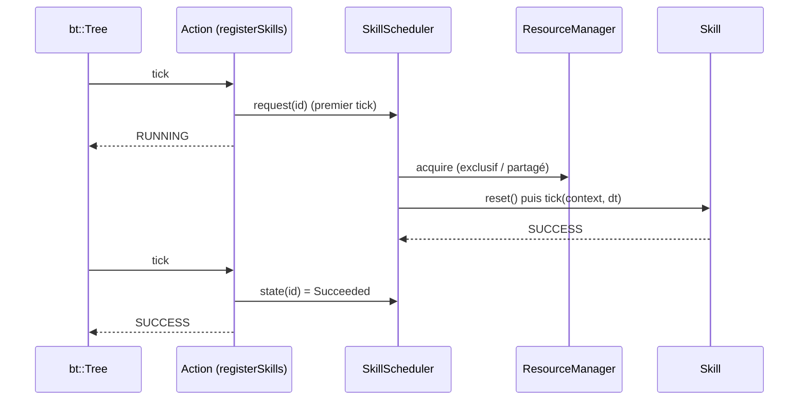

# Behavior tree, scheduler et skills

Trois couches distinctes :

| Couche | Où | Rôle |
|--------|----|------|
| **Action** (BlackThorn) | YAML : `Action: name: Grasp(red_cube)` | Feuille de l’arbre : *quand* faire quoi. |
| **SkillScheduler** (Robotik) | `Runtime/Scheduler.hpp` | *Si* la skill peut tourner : ressources, priorités, préconditions, pannes. |
| **Skill** (Robotik) | `Skills/*.hpp` | *Comment* : commande les actionneurs à chaque tick. |

L’arbre ne tick jamais une skill directement : une action **demande** la skill au scheduler, puis lit son état.



## Décrire une skill

```cpp
robotik::SkillDescription grasp;
grasp.name = "Grasp(red_cube)";
grasp.resources = { resources.require("gripper") };              // exclusif
grasp.priority = 100;
grasp.wait = false;          // ressource occupée : échec immédiat au lieu d'attendre
grasp.preconditions.push_back(
    { "gripper is empty", [](robotik::RobotContext const& p_context) { return !gripperHolds(p_context); } });
auto const id = scheduler.add<robotik::GraspSkill>(grasp, /* arguments du constructeur */);
scheduler.request(id);
```

`Skill` a trois méthodes : `reset()` (début de run), `tick(context, dt)` → `Status`, et `cancel(context)` (arrêt coopératif : remettre le matériel dans un état sûr).

## Règles du scheduler

À chaque `update(context)` :

1. **Annulations** demandées (`cancel(id)`) : `Skill::cancel`, état `Cancelled`.
2. **Ressources perdues** : une skill active dont une ressource est tombée en panne s’arrête (`Failed`, raison `ResourceLost`).
3. **Admission** des skills en attente, par priorité décroissante puis ordre de demande :
   - ressource en panne → `Failed (Unavailable)` ;
   - précondition fausse → attente (ou échec si `wait = false`) ;
   - ressource tenue par une skill **moins prioritaire et annulable** → **préemption** (`Cancelled (Preempted)`) ;
   - sinon ressource occupée → attente `Busy` (ou échec si `wait = false`).
4. **Tick** des skills actives, par priorité.

Chaque run est enregistré dans `trace()` (`SkillRun` : skill, état, raison, ressource bloquante, début, fin) : frise du simulateur et sortie de `Robotik-Headless`.

## Pont BlackThorn

`registerSkills(factory, scheduler)` crée une action par skill, sous son nom :

| État de la skill | Retour au BT |
|------------------|--------------|
| `Waiting`, `Running` | `RUNNING` |
| `Succeeded` | `SUCCESS` |
| `Failed`, `Cancelled` | `FAILURE` |

Quand le BT abandonne une action (halt d’une branche), la skill est annulée. Une panne ne fait donc qu’échouer des actions : la reprise s’écrit dans l’arbre, par exemple :

```yaml
- UntilSuccess:          # la caméra peut être en panne : on réessaie
    attempts: 1000
    child:
      - Action:
          name: Detect(red_cube)
```

## Statuts

| `robotik::Status` | Sens |
|-------------------|------|
| `RUNNING` | La skill continue au prochain pas. |
| `SUCCESS` | Objectif atteint ; ressources libérées. |
| `FAILURE` | Échec ; ressources libérées. |

## Tester une skill sans behavior tree

Construire un `RobotSession`, un `ResourceManager` (celui du robot) et un `SkillScheduler`, puis appeler `request` / `update` (voir `tests/Runtime/TestScheduler.cpp`). Le BT n’est qu’un client du scheduler, comme le bouton d’arrêt d’urgence du simulateur ou une politique RL.

## Fichiers utiles

| Fichier | Contenu |
|---------|---------|
| `include/Robotik/Skills/Skill.hpp` | `Skill`, `SkillDescription`, `Precondition` |
| `include/Robotik/Runtime/Scheduler.hpp` | `SkillScheduler`, `SkillState`, `SkillReason`, `SkillRun` |
| `include/Robotik/Runtime/Resources.hpp` | `ResourceManager`, `ResourceLease` |
| `include/Robotik/Skills/SkillNodes.hpp` | `registerSkills` |
| `src/Robotik/Runtime/Simulation.cpp` | Skills du pick-and-place |
| `data/scenarios/*.bt.yml` | Arbres |
