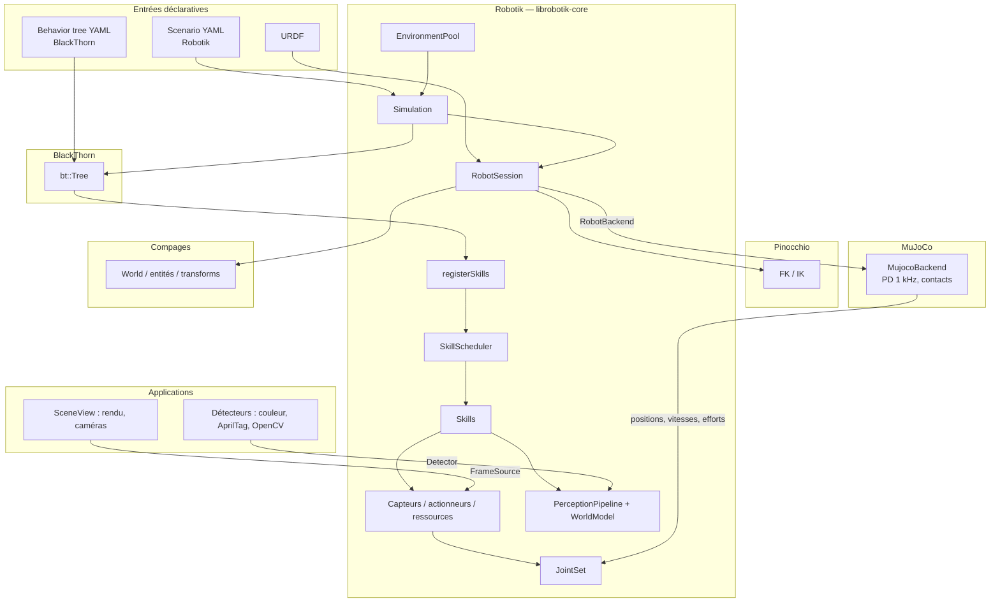

# Écosystème : Compages, Pinocchio, MuJoCo, BlackThorn

Robotik n’est pas un moteur de simulation monolithique : c’est une **couche d’orchestration** qui assemble des briques complémentaires derrière une API robot compacte (`Robot`, `JointSet`, capteurs, actionneurs, ressources, skills).

## Schéma des liens

| Lien | Rôle |
|------|------|
| **Compages ↔ Robotik** | Le `World` porte les entités des liens et des objets ; `RobotSession` y projette les positions des joints. Le rendu (meshes, caméras) est dans les applications, via `SceneView`. |
| **Pinocchio ↔ Robotik** | `PinocchioBackend` : poses des liens et IK (`Robot::pose`, `Robot::solve`) pour les skills cartésiennes et la ventouse. |
| **MuJoCo ↔ Robotik** | `MujocoBackend` implémente `RobotBackend` : PD par joint à 1 kHz, intégration, contacts, mesure du `JointSet`. |
| **BlackThorn ↔ Robotik** | `registerSkills` expose chaque skill du scheduler comme action ; BlackThorn ignore MuJoCo, Pinocchio et les ressources. |
| **Applications** | OpenCV et AprilTag (démo LineFollower), détecteur couleur (simulateur) : branchés comme `Detector` / `FrameSource`, jamais dans la bibliothèque. |

## Qui fait quoi ?

| Bibliothèque | Responsabilité | Ce que Robotik **ne** lui demande **pas** |
|--------------|----------------|-------------------------------------------|
| **[Compages](https://github.com/Lecrapouille/Compages)** | Entités, parents/enfants, rendu GPU, caméras | Mission, IK, contacts |
| **[Pinocchio](https://github.com/stack-of-tasks/pinocchio)** | Cinématique analytique, IK | Contacts, rendu |
| **[MuJoCo](https://github.com/google-deepmind/mujoco)** | Dynamique, contacts | Behavior tree, scénario |
| **[BlackThorn](https://github.com/Lecrapouille/BlackThorn)** | Behavior tree, YAML | Commande des joints, arbitrage des ressources |
| **[apriltag](https://github.com/AprilRobotics/apriltag)** | Détection de tags et pose (démo LineFollower) | — |
| **OpenCV** | Traitement d’image des démos | Rien dans la bibliothèque |

## Ordre d’un pas

1. Pannes (`FaultInjector`).
2. Behavior tree : demandes et annulations de skills.
3. `SkillScheduler` : ressources, priorités, préemption, tick des skills.
4. `RobotSession::step` : backend (MuJoCo), Pinocchio, transforms Compages, capteurs → perception → `WorldModel`.
5. `GraspSystem` : objets tenus par la ventouse.

Détail des dossiers : [Architecture-Robotik.md](Architecture-Robotik.md).

## Visualisation

Le simulateur affiche la frise des skills (`SkillScheduler::trace`), l’état des ressources et des pannes. BlackThorn peut en plus exposer l’arbre à **Oakular** par le réseau (SFML).
