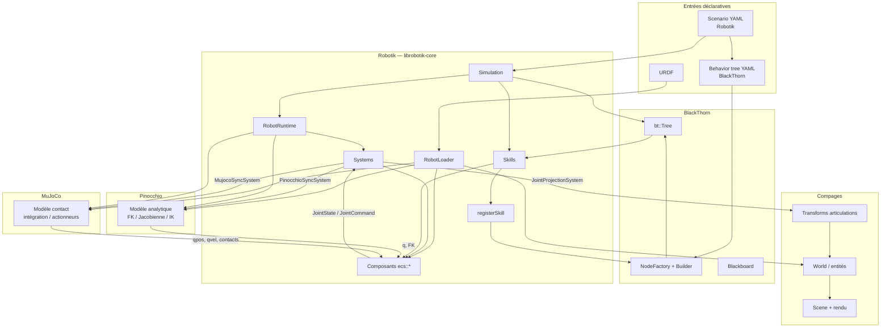

# Écosystème : Compages, Pinocchio, MuJoCo, BlackThorn

Robotik n’est pas un moteur de simulation monolithique : c’est une **couche d’orchestration** qui assemble quatre briques complémentaires autour d’un **monde ECS** (Entité–Composant–Système) hébergé par Compages.

## Schéma des liens

Légende des **flux principaux** :

| Lien | Sens | Rôle |
|------|------|------|
| **Compages ↔ Robotik** | bidirectionnel | Le `World` porte entités-liens, caméra, sol ; Robotik y attache l’ECS et projette les angles joints sur la hiérarchie pour le rendu. |
| **Pinocchio ↔ ECS** | via `PinocchioBackend` + `PinocchioSyncSystem` | Copie des positions joints → `q` ; FK / IK pour skills cartésiens (`MoveTCPSkill`, `GraspSystem`). |
| **MuJoCo ↔ ECS** | via `MujocoBackend` + `MujocoSyncSystem` | PD → efforts → pas physique ; relecture état pour les skills et la perception. |
| **BlackThorn ↔ Skills** | via `registerSkill` | Le YAML BT nomme des **actions** ; chaque action appelle une **skill** C++ (`Skill::tick`) sans que BlackThorn connaisse MuJoCo ou Pinocchio. |
| **Scenario YAML** | Robotik | Fichier mission (robot, objets, chemin BT, assertions) ; le parser réutilise le backend YAML de BlackThorn pour la lecture. |

## Qui fait quoi ?

| Bibliothèque | Responsabilité dans Robotik | Ce que Robotik **n’** lui demande **pas** |
|--------------|----------------------------|-------------------------------------------|
| **[Compages](https://github.com/Lecrapouille/Compages)** | Scène 3D, entités, parents/enfants, caméra orbit, pipeline GPU | Planification de mission, IK, contacts |
| **[Pinocchio](https://github.com/stack-of-tasks/pinocchio)** | Cinématique analytique, IK numérique, poses outil | Simulation contact, rendu |
| **[MuJoCo](https://github.com/google-deepmind/mujoco)** | Dynamique, actionneurs, contacts, pas de temps | Behavior tree, chargement scénario |
| **[BlackThorn](https://github.com/Lecrapouille/BlackThorn)** | Arbre de comportement, ticks `RUNNING`/`SUCCESS`/`FAILURE`, chargement BT YAML | Commande bas niveau des joints (délégué aux skills) |

## Ordre d’un pas physique (rappel)

Les skills et le BT tournent **dans le même pas** que la physique ; les systems synchronisent ensuite les backends :

1. **ControllerSystem** — `JointCommand` → `ActuatorCommand` (PD).
2. **MujocoSyncSystem** — écrit les commandes, **MuJoCo** intègre, relit `JointState`.
3. **PinocchioSyncSystem** + **JointProjectionSystem** — alignement Pinocchio et transforms Compages.
4. **GraspSystem** — objets tenus (ventouse) suivent l’outil.

Voir [Architecture-Robotik.md](Architecture-Robotik.md) pour le détail des dossiers `include/Robotik/`.

## Visualisation optionnelle (Oakular)

BlackThorn peut exposer l’état de l’arbre via SFML (réseau) vers **Oakular**. Le simulateur affiche aussi une frise `SkillTrace` côté ImGui — deux façons de suivre la même exécution BT.
