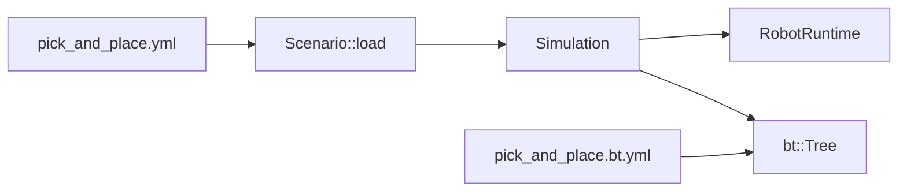

# Scénario YAML et Simulation

Un **scénario** est le fichier de mission déclaratif de Robotik : il décrit *quel* robot charger, *quoi* placer dans la scène, *quelle* tâche exécuter via un behavior tree, et *comment* juger le résultat. Il ne contient pas la logique de mouvement (c’est le rôle des **skills** C++ et du YAML BlackThorn séparé).

## Où ça vit dans le code

| Élément | Fichier / type | Rôle |
|--------|----------------|------|
| Schéma parsé | `robotik::Scenario` (`include/Robotik/Scenario/Scenario.hpp`) | Structure remplie par `Scenario::load` |
| Chargement | `src/Robotik/Scenario/Scenario.cpp` | YAML → champs ; résolution des chemins relatifs |
| Exécution | `robotik::Simulation` (`include/Robotik/Runtime/Simulation.hpp`) | Runtime, spawn, enregistrement des skills, tick du BT |
| Entrée apps | `Robotik-Simulator`, `Robotik-Headless` | `Scenario::load(chemin)` puis boucle `Simulation::step` |

## Structure du YAML scénario

Exemple réel : `data/scenarios/pick_and_place.yml`.

### `scenario:`

Identifiant court (champ `Scenario::name`), affiché dans l’UI.

### `world.robot`

| Clé | C++ | Notes |
|-----|-----|--------|
| `model` | `robot_model` | Chemin URDF ; relatif au dossier du fichier scénario |
| `home` | `home` (`JointPosture`) | Positions initiales en **radians** ; passées à `RobotRuntime::hold` |
| `tool_length` | `tool_length` | Longueur ventouse le long de +Z flange (m) → `ecs::VacuumGripper` |
| `camera` | `optional<Camera>` | Lien URDF, pose, FOV, résolution → entité caméra + `ecs::CameraSensor` |

### `world.objects`

Liste d’objets manipulables. Chaque entrée devient un `Scenario::Object` :

- `name` — utilisé par les skills (`Detect`, `Grasp`, …) et les assertions ;
- `type` — `cube` ou `box` (`ecs::SceneObject::Type`) ;
- `size`, `color`, `position` — centre dans le repère base robot (m).

Au spawn, les entités sont **parentées à la racine du robot** (`Simulation::spawn`).

### `execute`

| Clé | C++ | Notes |
|-----|-----|--------|
| `task` | `task` | Texte libre pour l’opérateur (UI) |
| `behavior_tree` | `behavior_tree` | Chemin vers le YAML BlackThorn (relatif au scénario) |

Le fichier BT référence des **actions** par nom (`Home`, `Grasp(red_cube)`, …). Ces noms doivent correspondre aux enregistrements faits dans `Simulation::buildTree` via `registerSkill` — voir [BehaviorTree-et-Skills.md](BehaviorTree-et-Skills.md).

### `assert`

Liste de chaînes évaluées **après** la mission par `Simulation::checks()` (simulateur, headless). Exemples supportés :

- `robot.success` — le BT a terminé en SUCCESS ;
- `object("red_cube").inside("box")` — boîte englobante ;
- `gripper.empty` — pas d’objet sur `VacuumGripper::held` ;
- `collisions == 0` — pic de contacts MuJoCo.

## Chemins et unités

- **Chemins** : `std::filesystem::path` en C++ ; les relatifs (`../robot_6axis.urdf`, `pick_and_place.bt.yml`) sont normalisés depuis le répertoire du fichier scénario.
- **Home** : angles en radians dans le YAML (`Radians` après parse).
- **Longueurs** : mètres (`tool_length`, tailles et positions des objets).

## Cycle de vie d’une run

1. `Scenario::load(path)` — parse et résolution des chemins.
2. Constructeur `Simulation(world, scene?, scenario)` :
   - crée `RobotRuntime` avec `robot_model` ;
   - `hold(home)` ;
   - `spawn` — gripper, objets, caméra ;
   - `buildTree` — enregistre les skills pour chaque objet + charge le BT.
3. Boucle : `Simulation::step(Seconds)` — tick BT, pipeline physique, mise à jour monde.
4. Fin : `finished()` quand le BT est SUCCESS ou FAILURE ; puis `checks()`.

**Headless** : `scene == nullptr` — pas de meshes ni détection caméra ; `DetectSkill` réussit sans caméra. **Simulateur** : scene Compages, rendu, `ColorDetector` alimenté depuis les objets du scénario.

## Fichiers liés

| Fichier | Rôle |
|---------|------|
| `data/scenarios/pick_and_place.yml` | Scénario de référence |
| `data/scenarios/pick_and_place.bt.yml` | Arbre de comportement |
| `data/robot_6axis.urdf` | Modèle robot (chemin depuis le scénario) |

## Extension

Pour une nouvelle mission :

1. Copier le YAML scénario et le BT ;
2. Ajuster `world` et `execute.behavior_tree` ;
3. Si de nouvelles actions apparaissent dans le BT, les enregistrer dans `Simulation::buildTree` (ou factoriser l’enregistrement) ;
4. Ajouter des lignes `assert` si besoin, ou étendre `Simulation::checks` pour de nouveaux prédicats.
