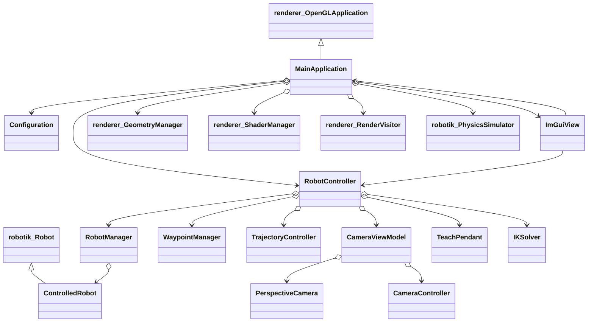
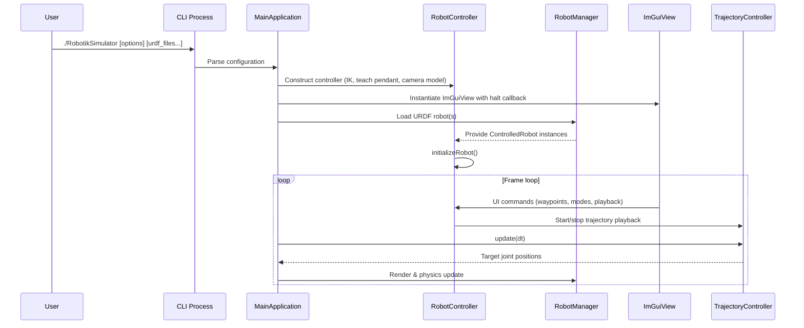

# RobotIK Standalone Application

## Overview

This 3D simulator provides a standalone application to load robots (from files such as URDF), visualize them (OpenGL), and control them (Dear Im Gui) via a teach pendant-style interface. The software architecture follows a Model-View-Controller pattern (MVC) built upon the `Robotik` infrastructure (`Robotik::Core` and `Robotik::Renderer`).

## Class Architecture



- `MainApplication`: entry point inheriting from `OpenGLApplication`; coordinates rendering, physics, robot loading, and MVC setup. It's the View module of the MVC pattern.
- `RobotController`: bridges `ControlledRobot` instances with shared services (teach pendant, IK solver, waypoint and trajectory managers) and exposes actions to the UI layer. It's the Controller module of the MVC pattern.
- `ControlledRobot`: inherits from `robotik::Robot` and stores UI-related state (control mode, camera tracking, frames). It's the Model module of the MVC pattern.
- `ImGuiView`: Dear ImGui front-end that orchestrates robot management, control modes, trajectory panels, and delegates to the controller. It's the View module of the MVC pattern.
- `CameraViewModel`: wraps the perspective camera and its controllers (`CameraController`, orbit, drag) to manage predefined views and tracking. It's the Model module of the MVC pattern.
- Renderer managers (`RobotManager`, `GeometryManager`, `ShaderManager`, `RenderVisitor`) plus `PhysicsSimulator`: provide rendering and simulation services consumed by `MainApplication`.

*Note: for simplicity, namespaces are omitted in the diagram.*

## Execution Flow



## Responsibilities of Key Components

- **Loading**: `MainApplication::setupRobots()` loads URDF robots through `RobotManager`, builds meshes via `GeometryManager`, and creates waypoint/trajectory helpers.
- **Control**: `RobotController` initializes each robot (home pose, end effector, camera target) and exposes helpers such as `setEndEffector`, `setCameraTarget`, and `setCartesianFrame`.
- **Interface**: `ImGuiView` aggregates panels (robot management, joint/cartesian controls, trajectories, camera) and communicates with the controller.
- **Camera**: `CameraViewModel` manages predefined views, tracking, and mouse interaction by orchestrating camera controllers.
- **Simulation & Rendering**: `MainApplication` drives the main loop (physics step, scene/menu panels) and renders robots, ground grid, axes, and waypoints.

## Launch the application and command line Options

Typical run:

```bash
./RobotikSimulator --width 1280 --height 720 robot1.urdf --home 0.0,1.57,0.0
```

Options handled in `main.cpp`:

- `-h`, `--help`: display usage and exit immediately.
- `--width <pixels>`: window width (default 1024).
- `--height <pixels>`: window height (default 768).
- `--fps <fps>`: target frame rate for the main loop (default 60).
- `--physics <hz>`: physics update frequency (default 15 Hz).
- `--gravity <value>`: Z component of gravity in m/s² (default -9.81); the vector is `(0, 0, value)`.
- `--home <values>`: comma-separated initial joint positions, e.g. `--home 0.0,1.57,0.0`.
- `urdf_files...`: additional URDF robot paths loaded at startup. Without files, the application starts with no robot.

Data paths (meshes, textures) are configured through `project::info::paths::data`. Invalid options or missing values print an error and stop the program.

> Note: this CLI will be replaced by a configuration file
